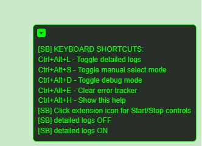

## SnapBubble


<div align="center">
  
  <h3>Translate any speech bubble, anywhere</h3>
  <p><em>Academic and research tool for image text translation</em></p>
</div>

## Overview

Translate any speech bubble, anywhere. SnapBubble OCRs text inside images (comics, panels, screenshots, photos) translates it, and overlays the result back into the bubble right on the page.

### Why SnapBubble

- **On-page overlays**: No switching tabs or copying text. Translations appear in place.
- **Multiple providers**: OCR via OCR.space or AI Vision; translation via Gemini, OpenAI, or DeepL.
- **Responsive UX**: Processes images near the viewport and draws progressively.
- **Privacy-aware**: Settings stored in your browser; you control API keys.

Additional capabilities:
- **Test API in popup**: Validate your provider/model and key by clicking the Test API control in the popup.
- **Multiple API keys with rotation**: Add several keys; the extension rotates on 429/limits and honors Retry‑After with per‑key cooldowns.
- **Sub‑second overlays**: Optimized micro‑batching and viewport prioritization keep perceived latency low (typically under 1s once OCR completes).
- **Manual select**: Translate any region by toggling manual selection (see shortcuts below).
- **Toolkits (hover help)**: Hover over controls/icons in the popup and HUD to read quick tips.


## Quick Start (sideload)

1) Download/unzip the extension folder.  
2) Chrome/Edge: open `chrome://extensions`, enable Developer mode, click “Load unpacked”, select the folder.  
   Firefox: open `about:debugging#/runtime/this-firefox`, click “Load Temporary Add-on…”, pick `manifest.json`.

Click the toolbar icon → Start. In the popup, you can also click **Test API** to verify keys and model selection before you begin.

<p>
  
</p>


## Settings (popup)

- **Target language**: The language to translate into (e.g., `en`, `fr`).
- **Translate provider**: Gemini, OpenAI, or DeepL. Paste your API key(s) if required.
- **Gemini model**: Choose from 2.0 Flash, 2.5 Flash, or 2.0 Flash‑Lite. Optional Tier‑1 toggle if your key supports it.
- **OCR**: OCR.space (with optional API key) or AI OCR (Gemini/OpenAI Vision) when enabled.
- **Force OCR language**: Improves accuracy on CJK (e.g., `chs`, `jpn`).
- **Minimum image size**: Skips tiny images to save time.
- **Debug panel**: Shows live logs and useful error messages.

## API keys

- OCR.space: [Free key](https://ocr.space/ocrapi/freekey)
- Google Gemini: [Gemini API key](https://ai.google.dev/gemini-api/docs/api-key)
- OpenAI: [OpenAI API keys](https://platform.openai.com/api-keys)
- DeepL: [DeepL API](https://www.deepl.com/pro-api)

Keyboard shortcuts:  
- Ctrl/Cmd+Alt+S: Manual select (drag a box to translate a specific region)  
- Ctrl/Cmd+Alt+L: Toggle detailed logs  
- Ctrl/Cmd+Alt+E: Clear error tracker  
- Ctrl/Cmd+Alt+H: Show shortcuts


## Community

- Discord: [https://discord.gg/vckeW3cXxS](https://discord.gg/vckeW3cXxS)


## How It Works (pipeline)

1) Detect visible images and prioritize ones near the viewport.  
2) OCR: extract words and their positions.  
3) Group words into speech bubbles.  
4) Translate bubbles.  
5) Draw overlays with wrapped text and adaptive font sizing.

Notes:
- Translation may micro-batch a few bubbles to avoid provider rate limits.
- Overlays are redrawn incrementally to keep earlier bubbles visible.


## Reliability and Limits

- Some providers enforce request-per-minute (RPM) limits. If you see 429/“rate limit” messages, slow down or use a higher‑tier key.  
- Network issues (timeouts/503) are retried briefly; persistent failures show readable HUD errors.  
- If OCR.space returns an error for certain images (e.g., unsupported types/hosts), try Manual Select or enable AI OCR.


## Troubleshooting

- “Testing…” stuck in popup: verify the selected model and API key; try toggling providers and saving again.  
- No overlays: reduce Minimum image size; ensure the image is in the main page (not inside a cross‑origin iframe).  
- OCR errors: provide an OCR.space key or enable AI OCR; try Manual Select for a specific region.  
- Rate limits: choose a lighter model or reduce parallelism; high RPM plans perform better.


## Contributing

PRs welcome. Keep features modular and focused. Useful areas: OCR robustness, grouping accuracy, overlay typography, translation adapters, and provider fallbacks.

Project layout:

```
/manifest.json
/background/ service-worker.js
/popup/      popup.html, popup.js
/content/    content.js
/lib/        utils.js, ocr.js, translate.js, overlay.js, segmentation.js...
```


## Legal Notice

### Academic Use Only
This software is provided for academic research, accessibility, and educational purposes only. Users are responsible for ensuring their use complies with applicable laws and terms of service of third-party APIs.

### Disclaimer
- This tool is provided "as is" without warranty
- Users are responsible for their own API usage and costs
- No copyrighted content is hosted or distributed by this extension
- Users must respect the terms of service of websites they visit

### Third-Party Services
This extension uses third-party APIs:
- **OCR.space**: For optical character recognition
- **OpenAI**: For GPT-based translation
- **Google**: For Gemini-based translation  
- **DeepL**: For high-quality translation

Users are responsible for complying with these services' terms of use and managing their own API usage and costs.


## License

This project is licensed under the MIT License - see the [LICENSE](LICENSE) file for details.

```
MIT License

Copyright (c) 2025 SnapBubble

Permission is hereby granted, free of charge, to any person obtaining a copy
of this software and associated documentation files (the "Software"), to deal
in the Software without restriction, including without limitation the rights
to use, copy, modify, merge, publish, distribute, sublicense, and/or sell
copies of the Software, and to permit persons to whom the Software is
furnished to do so, subject to the following conditions:

The above copyright notice and this permission notice shall be included in all
copies or substantial portions of the Software.

THE SOFTWARE IS PROVIDED "AS IS", WITHOUT WARRANTY OF ANY KIND, EXPRESS OR
IMPLIED, INCLUDING BUT NOT LIMITED TO THE WARRANTIES OF MERCHANTABILITY,
FITNESS FOR A PARTICULAR PURPOSE AND NONINFRINGEMENT. IN NO EVENT SHALL THE
AUTHORS OR COPYRIGHT HOLDERS BE LIABLE FOR ANY CLAIM, DAMAGES OR OTHER
LIABILITY, WHETHER IN AN ACTION OF CONTRACT, TORT OR OTHERWISE, ARISING FROM,
OUT OF OR IN CONNECTION WITH THE SOFTWARE OR THE USE OR OTHER DEALINGS IN THE
SOFTWARE.
```
